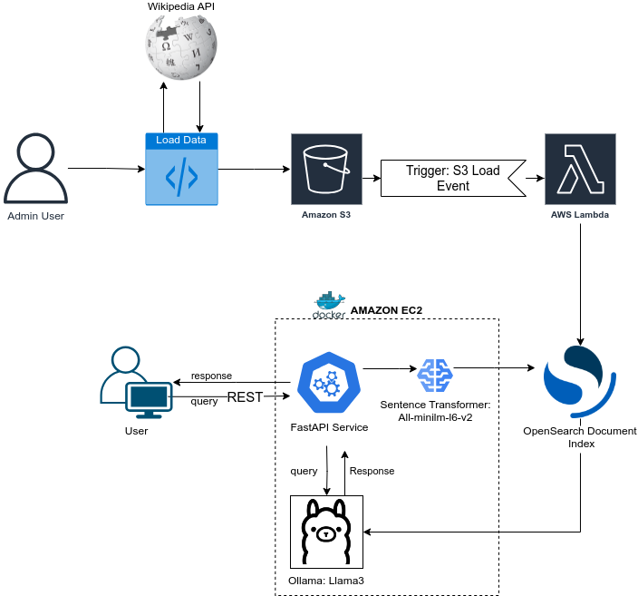

# rag-system-aws


### Table of Contents

- [About the project](#about-the-project)
    - [Built with](#built-with)
    - [RAG: Tech Specs](#rag-tech-specs)
- [Getting started](#getting-started)
    - [Installation](#installation)
    - [Folder structure](#folder-structure)
- [Deployment](#deployment)
    - [Local Deployment](#local-deployment)
    - [Docker Deployment](#docker-deployment)
- [Usage](#usage)
- [Contributing](#contributing)
- [License](#license)
- [Contact](#contact)
- [Acknowledgments](#acknowledgments)

# About the project

This project is designed as a study on Retrieval-Augmented Generation (RAG), focusing on leveraging AWS infrastructure to build an intelligent knowledge retrieval system. The system indexes Wikipedia articles, retrieves relevant data, and generates contextual responses using the Llama 3 language model.

The key objectives of this project are:
- Efficiently index and retrieve structured data from Wikipedia.
- Implement a semantic search mechanism with OpenSearch.
- Generate responses using an advanced LLM (Llama 3).
- Deploy the system as a REST API using AWS Lambda.
- Ensure scalability and reliability using Docker and EC2.


## Built with

The Rag System was built with the following technologies:

- [OpenSearch](https://opensearch.org/): Stores and indexes text embeddings for semantic search.
- [Llama3](https://www.llama.com/): An open-source LLM used to generate responses.
- [AWS Lambda](https://aws.amazon.com/es/pm/lambda/#Learn_more_about_building_with_AWS_Lambda): Serves as the API endpoint handling user queries.
- [AWS S3](https://aws.amazon.com/es/s3/?nc2=h_ql_prod_st_s3): ASGI server used to run the FastAPI application.
- [Docker](https://www.docker.com/) and [EC2](https://aws.amazon.com/es/ec2/): Used for deployment and containerized execution.

These technologies were chosen to provide a robust, scalable, and efficient solution.

## RAG Tech Specs

For more detailed specifications of the solution, see the file [RAG_Specs](./docs/RAG_Specs.md).



# Getting Started

## Installation

To install the Rag System in your machine, follow these steps:

1. Clone this repository to your local machine:
    ```bash
    git clone https://github.com/MateoVelasquez/rag-system-aws
    ```
2. Navigate to the project directory:
    ```bash
    cd rag-system-aws
    ```
3. You can install the Rag System AWS using pip.

    Using pip:
    ```bash
    pip install .
    ```

## Folder structure
The project directory structure is organized as follows:
```
rag-system-aws/
┣ app/
┃ ┣ api/
┃ ┃ ┣ __init__.py
┃ ┃ ┣ routes.py
┃ ┃ ┗ schemas.py
┃ ┣ services/
┃ ┃ ┣ __init__.py
┃ ┃ ┣ embedding.py
┃ ┃ ┣ llm.py
┃ ┃ ┣ rag_pipeline.py
┃ ┃ ┣ retrieval.py
┃ ┃ ┣ s3.py
┃ ┃ ┗ wikipedia.py
┃ ┣ utils/
┃ ┃ ┣ __init__.py
┃ ┃ ┗ load_initial_data.py
┃ ┣ __init__.py
┃ ┣ config.py
┃ ┗ main.py
┣ scripts/
┃ ┣ docs_to_os_index.py
┣ .env_template
┣ .gitignore
┣ LICENSE
┣ README.md
┣ dockerfile
┣ pyproject.toml
┣ requirements.txt
┗ ruff.toml
```
The application follows a **FastAPI-based architecture**, structured into distinct layers to ensure maintainability and scalability:

- **`api/`**: Defines FastAPI endpoints and request/response schemas.  
- **`services/`**: Implements core business logic, including retrievers and managers that interact with external systems.  
- **`utils/`**: Provides utility functions, including routines for loading initial data into S3 and OpenSearch.  
- **`scripts/`**: Contains scripts designed for execution in **AWS Lambda**, triggered by S3 file uploads.  
- **`main.py`**: The application’s entry point, responsible for initializing FastAPI and routing requests.  

This modular structure ensures **clear separation of concerns**, improving maintainability, scalability, and ease of extension. 🚀  

# Deployment

## Local Deployment:
To run the Rag System on your local machine, follow these steps:

1. Navigate to the project directory:
    ```bash
    cd rag-system-aws
    ```

2. Run the FastAPI application using Uvicorn:

    With uvicorn:
    ```bash
    uvicorn app.main:app --reload
    ```

**Note:** Ensure that you have set up the required environment variables as specified in the `.env_template` file and that **Ollama** with **Llama 3** is installed beforehand.  


## Docker Deployment:

1. Navigate to the project directory:
    ```bash
    cd rag-system-aws
    ```

2. Build Docker image:

    ```bash
    docker build -t rag-system-img .
    ```

3. Run Docker image:
    ```bash
    docker run -p 8000:8000 --name rag-system rag-system-img
    ```

If you have problems with Docker detecting Ollama, use the `--network=host` flag. This allows Docker to run on the same network, enabling it to find the Ollama server.
If you want to run the server in the background, use the `-d` flag.


# Usage  

Access the RAG System at [http://localhost:8000](http://localhost:8000) using your web browser or an API testing tool.
The RAG System provides a simple chat interface where you can inquire about topics related to:  

- **APIs:** FastAPI, ASGI, RESTful APIs, OAuth, JSON Schema, Swagger, OpenAPI, CORS.  
- **Amazon Web Services:** AWS Lambda, Amazon S3, Amazon DynamoDB, Amazon EC2, Amazon SageMaker, OpenSearch.  
- **Artificial Intelligence & Machine Learning:** Machine Learning, Deep Learning, NLP, Transformer architectures.  
- **Models & Tools:** GPT, LLaMA, Mistral AI, Hugging Face, Vector Databases, Embeddings.  

You can also interact with the available endpoints at [http://localhost:8000/docs](http://localhost:8000/docs) using tools like **cURL, Postman,** or any HTTP client library in your preferred programming language.  

> **Note:** The bot may take some time to respond as it is not a high-powered model.

# Contributing
Contributions are what make the open source community such an amazing place to learn, inspire, and create. Any contributions you make are greatly appreciated.

If you have a suggestion that would make this better, please fork the repo and create a pull request. You can also simply open an issue with the tag "enhancement". Don't forget to give the project a star! Thanks again!

1. Fork the Project
2. Create your Feature Branch (git checkout -b feature/1. AmazingFeature)
3. Commit your Changes (git commit -m 'Add some AmazingFeature')
4. Push to the Branch (git push origin feature/AmazingFeature)
5. Open a Pull Request

# License

Distributed under GNU License. See [LICENSE](LICENSE) for more information.

# Contact

If you have any questions, feedback, or suggestions, feel free to reach out to us:

- **Mateo Velásquez:** mateo10velasquez@hotmail.com
- **Project Link:** https://github.com/MateoVelasquez/rag-system-aws

We appreciate your interest and value your input!
