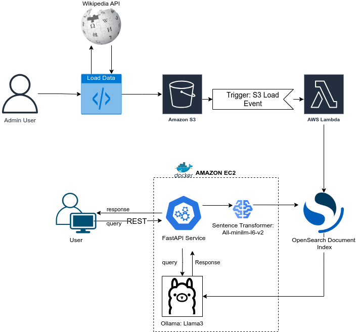

# RAG: Technical Specifications

The architecture used for this solution can be appreciated in the next image.


### 📌 Core Components  
- **LLM Models Used:** LLaMA 3, Qwen2.5-0.5B  
- **Embedding Model:** `sentence-transformers/all-MiniLM-L6-v2`  
- **Embedding Size:** 384  
- **Token Context:** Chunk size of 500 tokens with an overlap of 50  

### 🛠️ Retrieval Mechanism  
- **Vector Search Backend:** OpenSearch with **FAISS** for nearest neighbor search  
- **Similarity Metric:** **L2 (Euclidean distance)**  
- **Indexing Strategy:**  
  - Documents are chunked into **500-token segments** with an overlap of **50 tokens** before embedding  
  - **Embeddings stored as `knn_vector` (384 dimensions) using FAISS-HNSW**  
  - Text fields stored as **full-text searchable (`text` type)** 

### 📝 Prompt:
```
You are an AI assistant specialized in providing accurate
and context-aware responses.

Context:
{context}

Question:
{question}

Instructions:
- Answer concisely and directly based on the provided context.
- If the context lacks information, indicate it instead of making assumptions.
- Use clear and structured language to improve readability.

Answer:
```